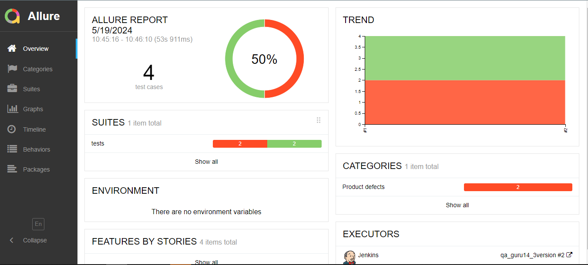
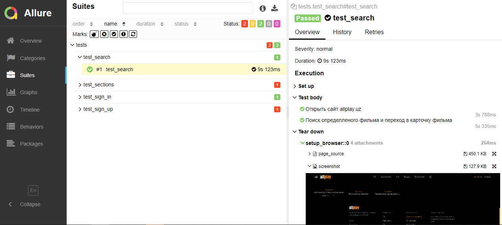

<h1 align="center">Фреймворк для автоматизации тестирование сайта Школы Английского языка "INTER NATION"</h1>


***
***Особенности проекта***  
-Оповещения о тестовых прогонах в Telegram  
-Отчеты с видео, скриншотом, логами, исходной моделью разметки страницы  
-Сборка проекта в Jenkins  
-Отчеты Allure Report  
-Интеграция с Allure TestOps
-Запуск web/UI автотестов в Selenoid.


***
***Список проверок, реализованных в web/UI автотестах***

-Отображение главной страницы  
-Автоскролинг при нажатии кнопки в шапке сайте  
-Проверка возможности оставить заявку для обратной связи  
-Автоматизация авторизации для студентов школы  
-Проверка страницы вакансии  

***


***Используемый стэк***  
<p align="left">


***  
***Запуск тестов***  
```
python -m venv .venv
source .venv/bin/activate
pip install -r requirements.txt
pytest .
```
***

***Примеры запуска***  

История запуска тестов и автоотчеты

  

***
Пример выполнение автоотеста

  

***
***Нотификация в телеграмме*** 

  

***

***Видео*** 

  

***